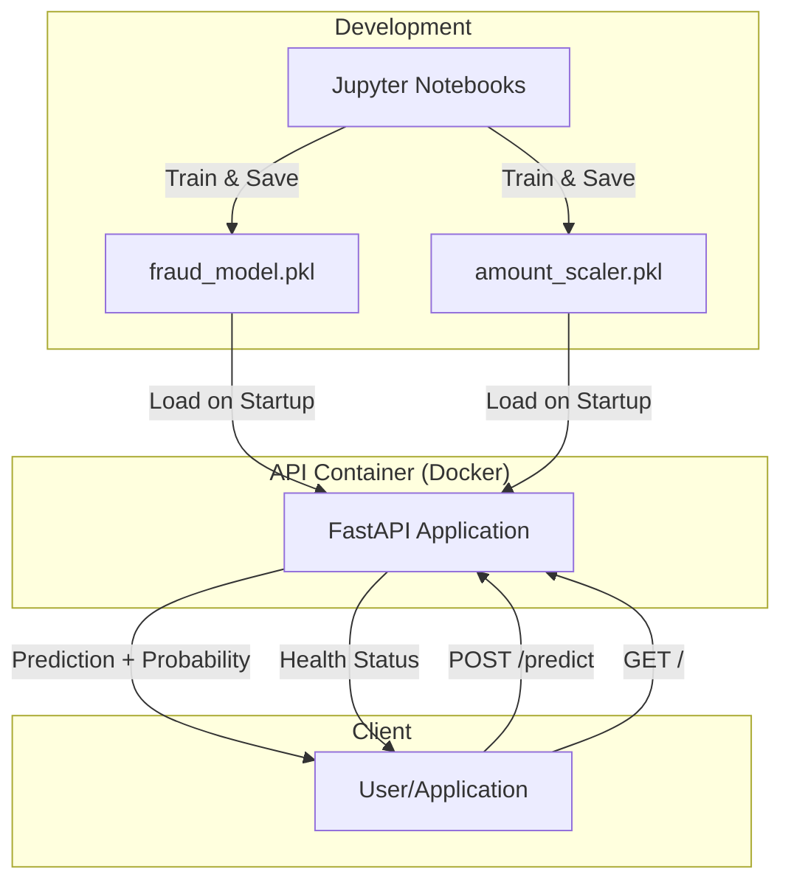
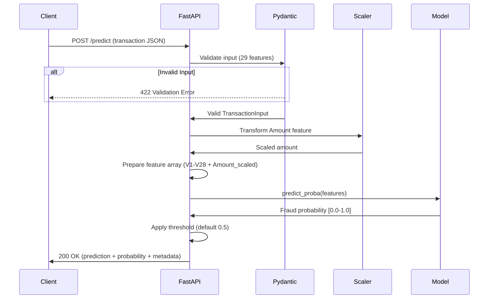

# Fraud Detection API

A simple end-to-end fraud detection model pipeline using open-source, anonymised transaction data.

Using: 
- scikit-learn to preprocess data, train a model & generate predictions
- pytest to implement a simple suite of tests
- FastAPI to build a basic API
- Docker for containerisation
- Mermaid to illustrate the architecture and request flow


## Dataset 
Dataset provided by MGL-ULB under the [Database Contents License (DbCL)](https://opendatacommons.org/licenses/dbcl/1-0/) and sourced from [kaggle.com](https://www.kaggle.com/datasets/mlg-ulb/creditcardfraud).

To download it via your CLI, run the following snippet:

```bash
kaggle datasets download -d mlg-ulb/creditcardfraud
```

To unzip for use with this project, run the following from within the repository after cloning:

```bash
mkdir -p data && unzip creditcardfraud.zip -d data/
```

The dataset contains:
- 284,807 transactions with a ~0.5% fraud rate (492 fraudulent transactions)
- Features V1-V28 are PCA-transformed (anonymised)
- Amount and Time features also included
- Binary target: Class (0=legitimate, 1=fraud)


## Project Structure

```
fraud-detection-api/
├── data/
│   └── creditcard.csv          # Training data (not in repo)
├── models/
│   ├── fraud_model.pkl         # Trained model (not in repo)
│   └── amount_scaler.pkl       # Feature scaler (not in repo)
├── notebooks/
│   ├── 00_eda.ipynb            # Exploratory data analysis
│   └── 01_model_training.ipynb # Model training & evaluation
├── src/
│   └── api.py                  # FastAPI application
├── tests/
│   └── test_api.py             # API tests (pytest)
│   └── example_fraud_transaction.json     # Sample fraud transaction to test API with
│   └── example_nonfraud_transaction.json  # Sample non-fraud transaction to test API with
├── dockerfile                  # Container definition
├── requirements.txt            # Python dependencies
└── README.md                   # Documentation
```


## Architecture



## Request Flow



## Quick Start - Running with Docker

To build the image, run:
```bash
docker build -t fraud-detection-api .
```

To run the container:
```bash
docker run -p 8000:8000 fraud-detection-api
```

To test the API:
```bash
curl http://localhost:8000/
```

Make a prediction: sample fraudulent transaction
```bash
curl -X POST http://localhost:8000/predict -H "Content-Type: application/json" -d @example_fraud_transaction.json
```
Make a prediction: sample non-fraudulent transaction
```bash
curl -X POST http://localhost:8000/predict -H "Content-Type: application/json" -d @example_nonfraud_transaction.json
```


## Running Tests
```bash
# Run all tests
python -m pytest tests/ -v

# Run with output (see print statements)
python -m pytest tests/ -v -s
```

### Test Coverage

- Input validation (negative amounts, missing features)
- API response format and types
- Health check endpoint
- End-to-end prediction flow


## Design Decisions

Some of the design decisions made when building the project were:

1. Model Choice: Logistic Regression
- Chosen since it is simple, highly interpretable & fast to train.

2. Class Imbalance: Class Weights
- class_weights='balanced' is a single-parameter solution to imbalanced data which avoids manipulating the dataset.
- This approach reduces the risk of overfit associated with oversampling while using all of the data available.

3. Metrics Priority: Recall over Precision
- In this domain, the cost of false negatives (missing fraud) is generally greater than that of false positives (false alarms).
- This simple model achieves 82% recall (catching most fraud) along with 5% precision (which is 10x better than random).
- The volume of false postives is feasible to screen manually and greatly reduces the effort vs. screening every transaction.

4. Model Loading: At Startup vs Per-Request
- The model is loaded once at startup & kept in memory.
- This minimises production latency by avoiding deserialisation per request.

5. Preprocessing Location: API owns it
- API performs preprocessing as well as serving predictions.
- Clients send raw data to the API, which simplifies retraining & avoids potential preprocessing inconsistencies.

6. Input Validation: Pydantic
- Helps prevent failures, unpredictable behaviour and 'garbage-in-garbage-out'.

7. Response Format: Prediction + Probability
- API returns both the binary decision (0/1) and the probability (0.0-1.0).
- Also includes classification threshold for transparency and model version for traceability.
- Provides flexibility for different downstream use cases.

8. Threshold Configuration: Environment Variable
- The threshold is set to 0.5 by default, but is configurable via an environment variable.
- Enables A/B testing and operational tuning without changing the code.

9. Containerisation: Docker with Slim Base
- The Docker image uses python:3.10-slim for greater efficiency in both storage & container startup time (120MB vs 900MB).
- Reproducible environments, exact dependency versions
    Layer caching optimisation (requirements before code)

10. Testing Strategy
- Basic set of unit tests & integration tests provided - not exhaustive, but sufficient for MVP.
- Uses TestClient with context manager to trigger FastAPI lifespan.
